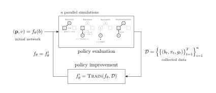

# BetaZero.jl

Belief-state planning algorithm for POMDPs using learned approximations; integrated into the [POMDPs.jl](https://github.com/JuliaPOMDP/POMDPs.jl) ecosystem. Implementations of the BetaZero (POMDP) and ConstrainedZero (CC-POMDP) policy iteration algorithms.

<!--  -->
<!--  -->

<p align="center">
    
</p>

## ConstrainedZero
For the _ConstrainedZero_ algorithm for CC-POMDPs, see the [#safety](https://github.com/sisl/BetaZero.jl/tree/safety) branch.

## Installation

To install the BetaZero solver, run:

```julia
using Pkg
pkg"add https://github.com/sisl/BetaZero.jl"
```

(**Optional**) To install the supporting example POMDP models (e.g., `LightDark` and `MinEx`), the `RemoteJobs` package, and the `ParticleBeliefs` wrapper, run:
```julia
using BetaZero
install_extras()
```


## Usage

The following code sets up the necessary interface functions `BetaZero.input_representation` and the optional `BetaZero.accuracy` for the _LightDark_ POMDP problem and solves it using BetaZero.

```julia
using BetaZero
using LightDark

pomdp = LightDarkPOMDP()
up = BootstrapFilter(pomdp, 500)

function BetaZero.input_representation(b::ParticleCollection{LightDarkState})
    # Function to get belief representation as input to neural network.
    μ, σ = mean_and_std(s.y for s in particles(b))
    return Float32[μ, σ]
end

function BetaZero.accuracy(pomdp::LightDarkPOMDP, b0, s0, states, actions, returns)
    # Function to determine accuracy of agent's final decision.
    return returns[end] == pomdp.correct_r
end

solver = BetaZeroSolver(pomdp=pomdp,
                        updater=up,
                        params=BetaZeroParameters(
                            n_iterations=50,
                            n_data_gen=50,
                        ),
                        nn_params=BetaZeroNetworkParameters(
                            pomdp, up;
                            training_epochs=50,
                            n_samples=100_000,
                            batchsize=1024,
                            learning_rate=1e-4,
                            λ_regularization=1e-5,
                            use_dropout=true,
                            p_dropout=0.2,
                        ),
                        verbose=true,
                        collect_metrics=true,
                        plot_incremental_data_gen=true)

policy = solve(solver, pomdp)
save_policy(policy, "policy.bson")
save_solver(solver, "solver.bson")
```
This example is also located at: [`scripts/readme_example.jl`](https://github.com/sisl/BetaZero.jl/blob/main/scripts/readme_example.jl)

## ConstrainedZero usage
To run using ConstainedZero (_citation under review_), turn on the `is_constrained` flag in the `BetaZeroSolver`:
```julia
solver.is_constrained = true
```
> NOTE: Make sure to remove any failure penalties from the POMDP reward function as well, e.g.,:
```julia
pomdp.incorrect_r = 0 # for LightDark CC-POMDP
```


### Parallel Usage

Using the `Distributed` package, you can easily launch workers to run the MCTS data collection in parallel.

```julia
using Distributed
addprocs([("user@hostname1", 25), ("user@hostname2", 25)], tunnel=true) # launch 50 processes across two separate hosts

@everywhere begin
    using BetaZero
    using LightDark

    pomdp = LightDarkPOMDP()
    up = BootstrapFilter(pomdp, 500)

    function BetaZero.input_representation(b::ParticleCollection{LightDarkState})
        # Function to get belief representation as input to neural network.
        μ, σ = mean_and_std(s.y for s in particles(b))
        return Float32[μ, σ]
    end

    function BetaZero.accuracy(pomdp::LightDarkPOMDP, b0, s0, states, actions, returns)
        # Function to determine accuracy of agent's final decision.
        return returns[end] == pomdp.correct_r
    end
end

solver = BetaZeroSolver(pomdp=pomdp,
                        updater=up,
                        params=BetaZeroParameters(
                            n_iterations=50,
                            n_data_gen=500, # Note increased to 500 when running in parallel.
                        ),
                        nn_params=BetaZeroNetworkParameters(
                            pomdp, up;
                            training_epochs=50,
                            n_samples=100_000,
                            batchsize=1024,
                            learning_rate=1e-4,
                            λ_regularization=1e-5,
                            use_dropout=true,
                            p_dropout=0.2,
                        ),
                        verbose=true,
                        collect_metrics=true,
                        plot_incremental_data_gen=true)

policy = solve(solver, pomdp)
save_policy(policy, "policy.bson")
save_solver(solver, "solver.bson")
```
This example is also located at: [`scripts/readme_example_parallel.jl`](https://github.com/sisl/BetaZero.jl/blob/main/scripts/readme_example_parallel.jl)


### Other Examples

See the following files for more examples:

- LightDark POMDP
    - Training [`scripts/train_lightdark.jl`](https://github.com/sisl/BetaZero.jl/blob/main/scripts/train_lightdark.jl)
    - Solver [`scripts/solver_lightdark.jl`](https://github.com/sisl/BetaZero.jl/blob/main/scripts/solver_lightdark.jl)
    - Representation [`scripts/representation_lightdark.jl`](https://github.com/sisl/BetaZero.jl/blob/main/scripts/representation_lightdark.jl)
- RockSample POMDP
    - Training [`scripts/train_rocksample.jl`](https://github.com/sisl/BetaZero.jl/blob/main/scripts/train_rocksample.jl)
    - Solver [`scripts/solver_rocksample.jl`](https://github.com/sisl/BetaZero.jl/blob/main/scripts/solver_rocksample.jl)
    - Representation [`scripts/representation_rocksample.jl`](https://github.com/sisl/BetaZero.jl/blob/main/scripts/representation_rocksample.jl)
- Mineral Exploration POMDP
    - Training [`scripts/train_minex.jl`](https://github.com/sisl/BetaZero.jl/blob/main/scripts/train_minex.jl)
    - Solver [`scripts/solver_minex.jl`](https://github.com/sisl/BetaZero.jl/blob/main/scripts/solver_minex.jl)
    - Representation [`scripts/representation_minex.jl`](https://github.com/sisl/BetaZero.jl/blob/main/scripts/representation_minex.jl)
- Aircraft Collision Avoidance (CAS) CC-POMDP: https://github.com/sisl/CollisionAvoidancePOMDPs.jl
    - Training [`scripts/train_cas.jl`](https://github.com/sisl/BetaZero.jl/blob/main/scripts/train_cas.jl)
    - Solver [`scripts/solver_cas.jl`](https://github.com/sisl/BetaZero.jl/blob/main/scripts/solver_cas.jl)
    - Representation [`scripts/representation_cas.jl`](https://github.com/sisl/BetaZero.jl/blob/main/scripts/representation_cas.jl)
- Spillpoint Carbon Storage (CCS) CC-POMDP: https://github.com/sisl/SpillpointPOMDP.jl
    - Training [`scripts/train_spillpoint.jl`](https://github.com/sisl/BetaZero.jl/blob/main/scripts/train_spillpoint.jl)
    - Solver [`scripts/solver_spillpoint.jl`](https://github.com/sisl/BetaZero.jl/blob/main/scripts/solver_spillpoint.jl)
    - Representation [`scripts/representation_spillpoint.jl`](https://github.com/sisl/BetaZero.jl/blob/main/scripts/representation_spillpoint.jl)


## Parameters
The parameters, their descriptions, and their defaults are defined in [`src/parameters.jl`](https://github.com/sisl/BetaZero.jl/blob/main/src/parameters.jl)

```julia
"""
Parameters for the BetaZero algorithm.
"""
@with_kw mutable struct BetaZeroParameters
    n_iterations::Int = 10                    # BetaZero policy iterations (primary outer loop).
    n_data_gen::Int = 100                     # Number of episodes to run for training/validation data generation.
    n_evaluate::Int = 0                       # Number of episodes to run for surrogate evaluation and comparison (when `n_evaluate == 0`, skip the evaluation step)
    n_holdout::Int = 0                        # Number of episodes to run for a holdout test set (on a fixed, non-training or evaluation set).
    n_buffer::Int = 1                         # Number of iterations to keep data for surrogate training (NOTE: each simulation has multiple time steps of data, not counted in this number. This number corresponds to the number of iterations, i.e., set to 2 if you want to keep data from the previous 2 policy iterations.)
    max_steps::Int = 100                      # Maximum number of steps for each simulation.
    λ_ucb::Real = 0.0                         # Upper confidence bound parameter for network evaluation/comparison: μ + λσ
    use_nn::Bool = true                       # Use neural network as the surrogate model
    use_completed_policy_gumbel::Bool = false # When using the Gumbel solver, use the completed policy estimate as the policy data
    use_raw_policy_network::Bool = false      # Generate data only from the raw policy network
    use_raw_value_network::Bool = false       # Generate data only from the raw value network (given a `n_obs` below)
    raw_value_network_n_obs::Int = 1          # When using the raw value network via `use_raw_value_network`, specify number of observations per action to expand on
    skip_missing_reward_signal::Bool = false  # When running MCTS episodes, filter out trajectories that had no reward signal (i.e., zero reward everywhere)
    train_missing_on_predicted::Bool = false  # Use predicted value in place of missing reward signal episodes
    eval_on_accuracy::Bool = false            # If evaluating (i.e., `n_evaluate > 0`), then base comparison on accuracy of the two networks
    bootstrap_q::Bool = false                 # Bootstrap the `init_Q` using the value network when a new (b,a) node is added during MCTS.
end
```

```julia
"""
Parameters for neural network surrogate model.
"""
@with_kw mutable struct BetaZeroNetworkParameters
    action_size::Int                                 # [REQUIRED] Number of actions in the action space
    input_size = (30,30,5)                           # Input belief size
    training_epochs::Int = 1000                      # Number of network training updates
    n_samples::Int = 10_000                          # Number of samples (i.e., simulated POMDP time steps from data collection) to use during training + validation
    normalize_input::Bool = true                     # Normalize input data to standard normal (0 mean)
    normalize_output::Bool = true                    # Normalize output (target) data to standard normal (0 mean)
    training_split::Float64 = 0.8                    # Training / validation split (Default: 80/20)
    sample_more_than_collected::Bool = true          # Sample more data (with replacement) than is in the buffer
    batchsize::Int = 512                             # Batch size
    learning_rate::Union{Float64,LearningRateScheduler} = 1e-3 # Learning rate for ADAM optimizer during training
    λ_regularization::Float64 = 1e-5                 # Parameter for L2-norm regularization
    optimizer = Adam                                 # Training optimizer (e.g., Adam, Descent, Nesterov)
    loss_func::Function = Flux.Losses.mse            # MAE works well for problems with large returns around zero, and spread out otherwise.
    activation::Function = relu                      # Activation function
    layer_size::Int = 64                             # Number of connections in fully connected layers (for CNN, refers to fully connected "head" layers)
    network_depth::Int = 2                           # Depth of the neural network (not including first layer and heads)
    use_cnn::Bool = false                            # Use convolutional neural network
    use_deepmind_arch::Bool = false                  # Use simplified non-resnet architecture from AlphaZero
    cnn_params::NamedTuple = (filter=(5,5), num_filters=[64, 128], num_dense=[256, 256])
    use_dropout::Bool = false                        # Indicate the use of dropout layers
    p_dropout::Float64 = 0.2                         # Probability of dropout
    use_batchnorm::Bool = false                      # Indicate the use of batch normalization layers
    batchnorm_momentum = 0.1f0                       # Momentum parameter for batch normalization
    use_dirichlet_exploration::Bool = false          # Apply Dirichlet noise to policy vector for exploration
    α_dirichlet::Float64 = 0.03                      # Alpha parameter of the Dirichlet action noise distribution
    ϵ_dirichlet::Float64 = 0.25                      # Weighting parameter for applying Dirichlet action noise
    use_prioritized_action_selection::Bool = true    # When performing action branching, select new actions from the policy network
    zero_out_tried_actions::Bool = false             # When selecting a next action to widen on, zero out the probabilities for already tried actions.
    next_action_return_argmax::Bool = false          # Instead of sampling, return the argmax action during action widening
    use_epsilon_greedy::Bool = false                 # Use epsilon-greedy exploration during action widening
    ϵ_greedy::Float64 = 0.0                          # Epsilon parameter to select random action during widening with probability ϵ_greedy
    value_loss_weight::Float32 = 0.5f0               # Weight applied to the value component of the loss function
    use_kl_loss::Bool = false                        # Use KL-divergence as classification (policy) loss (for Gumbel solver)
    incremental_save::Bool = false                   # Incrementally save off policy every iteration (TODO: fix undefined reference error)
    policy_filename::String = "betazero_policy.bson" # Filename when incrementally saving off poliy
    device = gpu                                     # Indicate what device to train on (`gpu` or `cpu`)
    use_checkpoint::Bool = true                      # Save networks along the way to use based on minimum validation loss
    checkpoint_frequency::Int = 1                    # How often do we evaluate and save a checkpoint?
    checkpoint_validation_loss::Bool = true          # Checkpoint based on minimum validation loss (`false` = checkpointing on training loss)
    stop_short::Bool = true                          # Cut the training off prematurely
    stop_short_threshold::Int = 1000                 # Cut training off if the validation loss has not improved for the set number of epochs
    verbose_update_frequency::Int = training_epochs  # Frequency of printed training output
    verbose_plot_frequency::Number = Inf             # Frequency of plotted training/validation output
    display_plots::Bool = false                      # Display training and validation plots after training
    save_plots::Bool = false                         # Save training and validation plots after training
    plot_curve_filename::String = "training_curve.png"                  # Filename for the training/validation loss curve
    plot_value_distribution_filename::String = "value_distribution.png" # Filename for the distribution of values (model vs. data)
    plot_training_bias_filename::String = "training_data.png"           # Filename the bias plots for training model vs. data
    plot_validation_bias_filename::String = "validation_data.png"       # Filename the bias plots for validation model vs. data
end
```

The default MCTS PUCT parameters are defined in [`src/BetaZero.jl`](https://github.com/sisl/BetaZero.jl/blob/main/src/BetaZero.jl) and [`submodules/MCTS/src/puct_types.jl`](https://github.com/sisl/BetaZero.jl/blob/main/submodules/MCTS/src/puct_types.jl).

```julia
solver = BetaZeroSolver(...)
solver.mcts_solver = PUCTSolver(
    n_iterations         = 100,
    exploration_constant = 1.0,
    k_action             = 2.0,
    alpha_action         = 0.25,
    k_state              = 2.0,
    alpha_state          = 0.1,
    counts_in_info       = true, # Note, required for policy vector.
    final_criterion      = MaxZQN(zq=1, zn=1),
)
```

Final criteria parameters are defined in [`submodules/MCTS/src/criteria.jl`](https://github.com/sisl/BetaZero.jl/blob/main/submodules/MCTS/src/criteria.jl).

```julia
# To sample from tree policy when selecting root node actions (ensures exploration), use:
solver.mcts_solver.final_criterion = SampleZQN(τ=1, zq=1, zn=1)

# To get the maximizing action, use:
solver.mcts_solver.final_criterion = MaxZQN(zq=1, zn=1)

# (which is equivalent to):
solver.mcts_solver.final_criterion = SampleZQN(τ=0, zq=1, zn=1)
```

ConstrainedZero criteria:
```julia
# ConstrainedZero: To use the CC-PUCT criteria that is subject to the failure probability threshold, use:
solver.mcts_solver.final_criterion = SampleZQNS(τ=1, zq=1, zn=1)

# ConstrainedZero: Or for the argmax, use:
solver.mcts_solver.final_criterion = MaxZQNS(zq=1, zn=1)
```


## Directory structure

    .
    ├── media                   # Image files.
    ├── scripts                 # Example scripts for training POMDPs, visualizations, and baselines.
    ├── src                     # Core Julia package files with BetaZero implementation and supporting code.
    ├── submodules              # Submodules used by the scripts.
    │   └── CryingBaby          # POMDP model for the crying baby problem.
    │   └── LightDark           # POMDP model for the light dark problem.
    │   └── MCTS                # MCTS.jl [1] fork with PUCT and BetaZero root action criteria.
    │   └── MinEx               # POMDP model for the mineral exploration problem.
    │   └── ParticleBeliefs     # Lightweight wrapper for a particle filter that stores actions and observations.
    │   └── RemoteJobs          # Lightweight package for launching remote workers and syncing code.
    │   └── RobotLocalization   # POMDP model for the robot localization problem (adapted from RoombaPOMDPs.jl [2]).
    │   └── Tiger               # POMDP model for the tiger problem.
    └── tex                     # LaTeX files for the TikZ mineral exploration policy maps.

[1] [https://github.com/JuliaPOMDP/MCTS.jl](https://github.com/JuliaPOMDP/MCTS.jl)

[2] [https://github.com/sisl/RoombaPOMDPs.jl](https://github.com/JuliaPOMDP/MCTS.jl)

## Citations

> BetaZero: Under review.

> ConstrainedZero: Under review.
